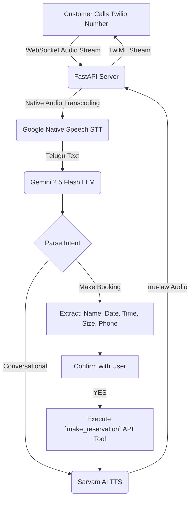

<div align="center">
  

  # 🎙️ Telugu Voice AI Telephony Concierge

  *A real-time, ultra-low latency Twilio telephony server featuring a native Telugu AI Concierge for automated restaurant reservations.*
</div>

## 📌 Overview

This project has evolved into a full-fledged **telephony server**. By integrating Twilio Media Streams, this application bridges traditional phone networks (PSTN) with a modern Voice AI backend. Customers can call a real phone number and instantly converse with "Prafful," a warm and lively restaurant host.

The agent speaks naturally in casual "Tanglish" (modern spoken Telugu mixed with common English words) and gracefully handles complex edge cases, time translations, and database tool execution.

## 🏗 Architecture



## ✨ Key Features
- **Twilio Telephony Integration**: Connects directly to the PSTN. Receives and manages live phone calls using WebSockets and TwiML.
- **Google Native Speech STT**: Achieves flawless native Telugu understanding, completely bypassing hallucinations caused by open-source models on noisy phone lines.
- **True Barge-In Interruption**: The AI behaves like a real human. If you speak while the AI is talking, it instantly halts its audio and listens to you.
- **0s Latency Startup**: Features an aggressive TTS cache pre-warming routine. The AI generates its greeting as the server boots and holds it in memory, answering the phone instantly without API delays.
- **Native Audio Transcoding**: Uses Python's native `audioop` and `wave` modules to flawlessly transcode between Twilio's 8kHz mu-law and the AI's 16kHz PCM formats without needing external dependencies like `ffmpeg`.
- **Casual "Tanglish" Persona**: Programmed to speak exactly how modern speakers do, blending casual Telugu with English terms to feel deeply human and welcoming.

## 🛠 Setup & Installation

1. **Python Environment**:
   ```bash
   python -m venv venv
   source venv/bin/activate  # On Windows use `venv\Scripts\activate`
   ```
2. **Install Requirements**:
   ```bash
   pip install -r requirements.txt
   ```
3. **Environment Variables**:
   Create a `.env` file with your keys:
   ```env
   GEMINI_API_KEY=your_gemini_key
   SARVAM_API_KEY=your_sarvam_key
   ```
4. **Run the Server**:
   ```bash
   python main.py
   ```
5. **Connect to Twilio**:
   Use Cloudflare or LocalTunnel to expose port 8000 to the web, and paste the URL into your Twilio Webhook settings with the endpoint `npx -y cloudflared tunnel --url http://localhost:8000`.

---

<div align="center">
  <i>Built with ❤️ by Prafful.</i>
</div>
