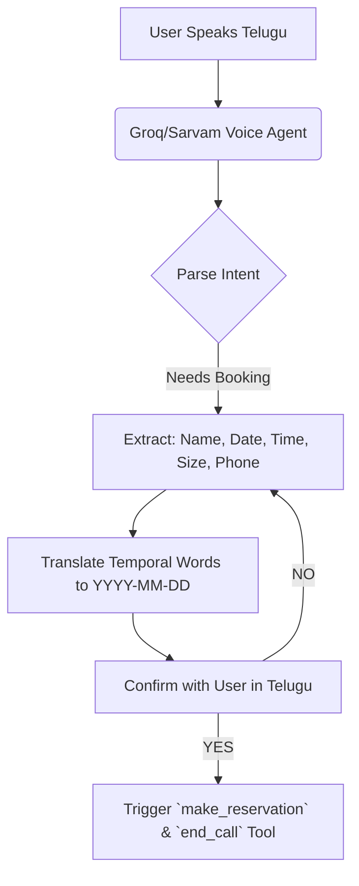

<div align="center">
  

  # 🎙️ Custom Telugu Voice AI Concierge

  *A specialized Voice AI implementation designed to converse fluently in native Telugu for automated restaurant reservations.*
</div>

## 📌 Overview

This project explores hyper-localized Voice AI using Groq (for LLM and Whisper STT) and Sarvam AI (for Telugu TTS). By carefully crafting system prompts and tool constraints, this agent acts as "Prafful," a warm and lively host who speaks entirely in the Telugu language (తెలుగు లిపి).

It is designed to gracefully handle edge cases, translate Telugu temporal words (like "repu" for tomorrow) into ISO dates, and securely pass these to a backend API.

## 🏗 Architecture



## ✨ Key Features
- **Native Telugu Support**: Enforced to only speak and process the Telugu language naturally.
- **Temporal Translation**: Understands and translates cultural time references (eroju, repu, ellundi) into structured data.
- **Robust Tool Usage**: Automatically fires `make_reservation` and gracefully ends the call using the `end_call` tool when the transaction completes.
- **Anti-Hallucination Guardrails**: Strictly prevents the AI from guessing missing phone numbers or party sizes.

## 🛠 Setup & Installation

1. **Python Environment**:
   ```bash
   python -m venv venv
   source venv/bin/activate  # On Windows use `venv\Scripts\activate`
   ```
2. **Install Requirements**:
   ```bash
   pip install -r requirements.txt
   ```
3. **Run the Test Script**:
   ```bash
   python test_tts.py
   ```

## 💡 Example Output

**System Prompt Snippet (config.json):**
```json
{
  "first_message": "నమస్కారం, గోల్డెన్ సాఫ్రాన్ రెస్టారెంట్ కి స్వాగతం...",
  "system_prompt": "You MUST ALWAYS reply entirely in the Telugu language..."
}
```

---

<div align="center">
  <i>Built with ❤️ by Prafful.</i>
</div>
